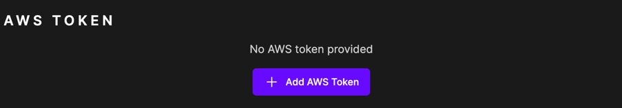
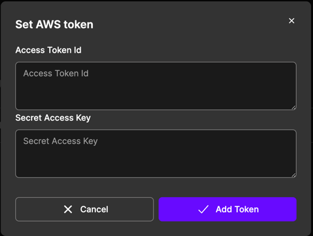
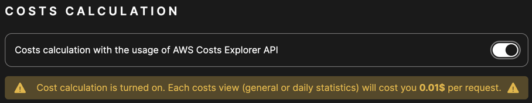

# Account

The Account page allows you to manage your account settings.

## AWS Token

To use Multiverse, you need to provide your AWS access key and secret key. These are root keys to your account and 
Multiverse will not use them to perform any operations other than the ones you request. Your keys are stored securely
in the Multiverse and secret token is encrypted.

To create a new AWS access key and secret key, follow these steps:
- open the [Identity and Access Management (IAM) console](https://us-east-1.console.aws.amazon.com/iam/home#/security_credentials)
- in the navigation pane, choose **Security credentials**
- find section Access keys and choose **Create access key**
- choose **Download .csv file** to save the access key and secret key to a file on your computer

Provide these credentials to Multiverse by clicking on `Add AWS Token` button and pasting the keys into the form.
Wait for the initialization to finish and you are ready to use Multiverse.

## Costs calculation

Disabled by default, cost calculation allows you to see the real costs of using Multiverse. It is disabled to prevent
unnecessary costs, since the AWS Cost Explorer API costs **0.01$ per request**. To enable the cost calculation turn it on
by clicking on the switch in the Costs calculation section.

