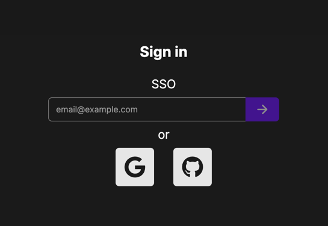

# Authentication and Sign-up

Multiverse UI allows you to log in using the following methods:
- SSO (Magic Link login)
- Google OAuth
- GitHub OAuth

## SSO (Magic Link Login)

On the Login page, enter your email address and click the Login button. Then check your email inbox and click the link
to log in. Your account will be automatically created if it doesn't exist.

If you don't receive the email, check your spam folder.

## Google OAuth

On the Login page, click the Google button. You will be redirected to the Google login page. Enter your Google credentials
to authenticate with Google and log in to Multiverse UI. Your account will be automatically created if it doesn't exist.

## GitHub OAuth

On the Login page, click the GitHub button. You will be redirected to the GitHub login page. Enter your GitHub credentials
to authenticate with GitHub and log in to Multiverse UI. Your account will be automatically created if it doesn't exist.