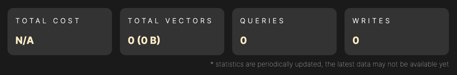
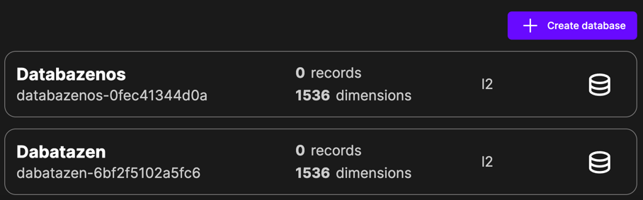
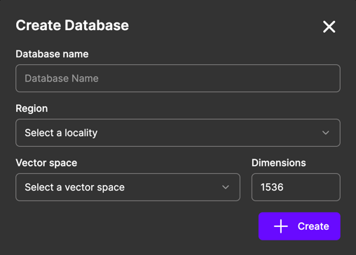

# Database List

In the Database List page you can view all the databases you have created.

## General statistics

These statistics are a combining the statistics of all your databases from the start of the month. Statistics are
periodically updated, and you might not be able to see the real-time data. If you want to see the real-time data, you have
to wait for the next update or refresh the statistics.

### Total cost

If you have **costs calculation** enabled, you will see the costs for all the databases summed up with other multiverse
costs in your account.

### Total vectors

Here you can see the total number of vectors stored in all your databases. You can also see the size of the stored data
in your databases combined.

### Queries

The number of queries you have performed on all your databases since the start of the month.

### Writes

The number of writes you have performed on all your databases since the start of the month.

## Databases

Here you can see all the databases you have created. For each database you can see the following information:
- **Name**: The name of the database. If you created your database externally, this name might be the same as the code name.
- **Code name**: The code name of the database, how it is referenced in the Multiverse.
- **Records**: The number of vectors stored in the database.
- **Dimensions**: The number of dimensions of the vectors stored in the database.
- **Metrics**: The metric used to calculate the distance between vectors.

### View your database

To view the database, click on the database in the list. You will be redirected to the database page where you can see the
details of the database and perform operations on it.

### Create database

To create a new database, click on the `Create database` button. Fill out the form, and your database will be created. You
can use same database name for multiple databases, but this is not recommended since it might be hard to distinguish between
them. You can reference to the created database in the Multiverse by the code name.

It might take a while to create the database. After you create it, you will have to wait until it is created to start using
it. You can see the databases currently being created above the database list. If you delete a database (from the general section),
it will be shown as well.

