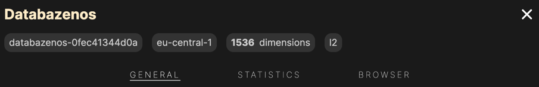
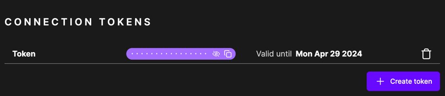
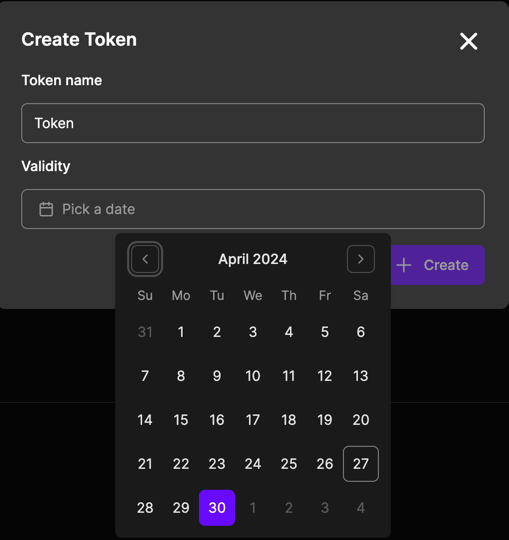
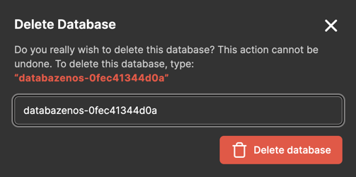

# Database - General

In the Database General page you can view the general information about the database.

## Database Info

On the top of the page you can see the database name, code name, region (currently only `eu-central-1`), dimensions and metrics.

## General Statistics

Similar to the *Database List*, you can view general statistics related to the specific database. These statistics are 
however specific to the database you are viewing. The statistics are periodically updated, and you might not be able to see
the real-time data. If you want to see the real-time data, you have to wait for the next update or refresh the statistics.

## Connection tokens

You can create connection tokens to connect to the database externally, without AWS credentials. This is useful if you want to
connect to the database from a different service, or if you want to share the database with someone else. The connection token
allows only vector operations (query, upsert, remove) and it cannot be used to delete or create new databases.

To create a new connection token, click on the `Create token` button. Fill out the form and click the `Create` button.
You have to specify the token name (has to be unique) and the validity date. The invalid token will not be able to connect to
the database and it cannot be revalidated. To revoke the token, you have to delete it.

While the initial list is empty, Multiverse UI creates a "default" connection token, which is used by the Multiverse
Library. You cannot delete this token from Multiverse UI, but you can do so from the Multiverse Library. Multiverse UI
will however not be able to connect to the database if the default token is deleted, if no other token is created.

## Delete database

To delete the database, click on the `Delete database` button. You will be asked to confirm the deletion by typing in the
database code name. After you confirm the deletion, you will be redirected to the Database List page.

