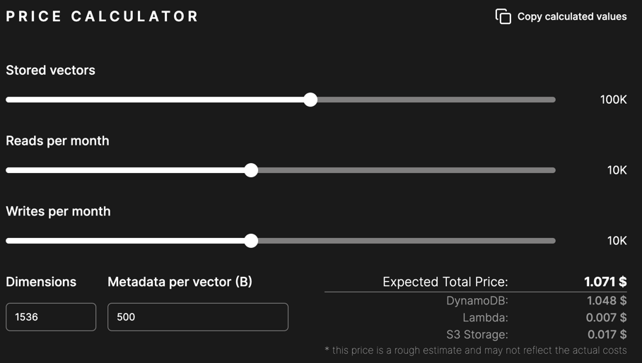

# Pricing

While Multiverse is completely free to use, it uses your AWS account through provided AWS access key and secret key to 
perform operations. This means that you will be charged by AWS for the resources you use. This way, you only have to pay
once inside your AWS account, and you can use Multiverse as much as you want.

The Pricing page allows you to calculate expected costs based on your usage.

## Stored vectors

Stored vectors is expected number of vectors you will store in Multiverse. These vectors will be stored in the AWS S3
bucket automatically created by Multiverse.

## Reads per month

Reads per month is the expected number of reads you will perform on the vectors stored in Multiverse. Each read
operation is done by the Multiverse inside your AWS account.

## Writes per month

Writes per month is the expected number of writes (vector upsertion and removal) you will perform on the vectors stored 
in Multiverse. Each write operation is done by the Multiverse inside your AWS account.

## Dimensions and Metadata per vector

Dimensions and Metadata size specify the size of each vector. While the dimensions are fixed for the database, the
metadata size can be adjusted based on your needs. To achieve the most accurate pricing, try to estimate the average
metadata size for each vector.

## Expected total price

At the bottom of the calculator you can see the expected total price based on the provided values. This price is an
rough estimate, and it may not reflect the actual costs. Under the total price you can see how much each AWS service
will cost you.

## Copy calculated values

You can copy the calculated values by clicking the "Copy calculated values" button. This will copy the values to your
clipboard in a JSON format.

## My Plan

If authenticated, in this section you can view your current **real usage** and **costs** of the Multiverse. You can 
compare the real usage with the expected usage and see the difference in costs. This way you can easily see if you are 
overusing the Multiverse and adjust your usage accordingly.

Notice that you have to have your **AWS credentials** set up in the Multiverse to see the real usage and costs. To see the
calculated costs, you have to **enable** the cost calculation in your account. The calculation is disabled by default to
prevent unnecessary costs. Multiverse uses the AWS Cost Explorer API to calculate the costs, which costs 0.01$ per request,
therefore 0.01$ per view. This cost is not included in the total price, since it is an external service to Multiverse.

You can however see your costs in the AWS Cost Explorer in your AWS account, which is for free. The multiverse service
will not be filtered out of other costs, so it might be more difficult to see the exact costs of the Multiverse. It is 
recommended to use the Multiverse cost calculation **only** when you need to check your costs, and **disable** it afterwards.